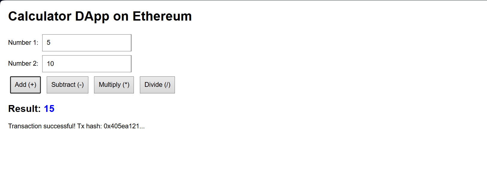
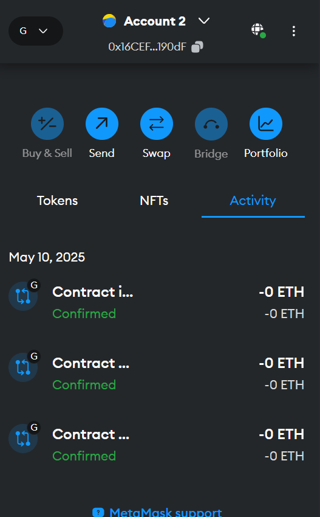
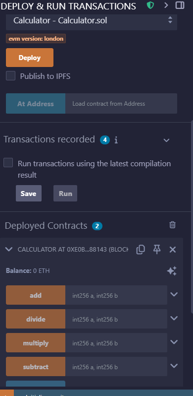

# Calculator DApp
A simple decentralized calculator application built on Ethereum.

## Overview
This project implements a basic calculator as a decentralized application (DApp). Operations are executed as transactions on the Ethereum blockchain via a smart contract, with results stored on-chain.

## Features
- Addition, subtraction, multiplication, and division operations
- Blockchain persistence of calculation results
- MetaMask integration for transaction signing
- Simple and intuitive user interface

## Application Preview

<p align="center">
  <strong>Calculator DApp Interface</strong><br>
  
</p>

<p align="center">
  <strong>MetaMask Transaction</strong>
  &nbsp;&nbsp;&nbsp;&nbsp;&nbsp;&nbsp;&nbsp;&nbsp;&nbsp;&nbsp;&nbsp;&nbsp;&nbsp;&nbsp;&nbsp;&nbsp;&nbsp;&nbsp;&nbsp;&nbsp;
  <strong>Smart Contract Deployment</strong><br>
  
  &nbsp;&nbsp;&nbsp;&nbsp;
  
</p>

## Technologies Used
- Solidity (Smart Contract)
- Web3.js (Blockchain Interaction)
- HTML/CSS/JavaScript (Frontend)
- Ganache (Local Blockchain)
- MetaMask (Wallet Integration)

## Setup Instructions
1. **Prerequisites:**
   - Node.js and npm
   - Ganache
   - MetaMask browser extension

2. **Installation:**
   ```bash
   git clone <repository-url> (or download the ZIP)
   cd calculator-dapp
   npm init -y
   ```

3. **Deploy the Smart Contract:**
   - Start Ganache
   - Deploy the contract using Remix IDE connected to Ganache via MetaMask
   - Copy the deployed contract address and ABI

4. **Configure the Frontend:**
   - Create index.html with the provided code
   - Update the contract address and ABI in index.html

5. **Run the Application:**
   ```bash
   npm start
   ```
   - Open http://localhost:3000 in your browser
   - Connect with MetaMask

## Usage
1. Enter two numbers in the input fields
2. Click one of the operation buttons (Add, Subtract, Multiply, Divide)
3. Confirm the transaction in MetaMask
4. View the result displayed on the page

## Smart Contract Code
```solidity
// SPDX-License-Identifier: MIT
pragma solidity ^0.8.0;

contract Calculator {
    int256 public result;
    
    function add(int256 a, int256 b) public returns (int256) {
        result = a + b;
        return result;
    }
    
    function subtract(int256 a, int256 b) public returns (int256) {
        result = a - b;
        return result;
    }
    
    function multiply(int256 a, int256 b) public returns (int256) {
        result = a * b;
        return result;
    }
    
    function divide(int256 a, int256 b) public returns (int256) {
        require(b != 0, "Cannot divide by zero");
        result = a / b;
        return result;
    }
}
```

## Implementation Details
The calculator operations are implemented as functions in the Solidity smart contract:
- `add(int256 a, int256 b)`: Adds two integers and stores the result
- `subtract(int256 a, int256 b)`: Subtracts the second integer from the first
- `multiply(int256 a, int256 b)`: Multiplies two integers
- `divide(int256 a, int256 b)`: Divides the first integer by the second (with zero-check)

Each operation stores the result in the contract state variable and returns it to the user.

## Project Structure
```
calculator-dapp/
├── screenshots/          # Application screenshots
│   ├── remix-deployment.png
│   ├── metamask.png
│   └── dapp-ui.png
├── Calculator.sol        # Solidity smart contract
├── index.html            # Frontend interface
├── package.json          # Project configuration
└── README.md             # Project documentation
```

## Troubleshooting
- **MetaMask Connection Issues**: Ensure MetaMask is unlocked and connected to your Ganache network
- **Transaction Failures**: Check that your account has sufficient ETH for gas fees
- **Contract Deployment Errors**: Verify the compiler version and EVM settings in Remix match Ganache

## Future Enhancements
- Add more complex mathematical operations
- Implement calculation history storage
- Create a more sophisticated UI with transaction status indicators
- Add user authentication and personal calculation history

## Contributing
1. Fork the repository
2. Create a feature branch
3. Make your changes
4. Add screenshots if you modify the UI
5. Submit a pull request

## License
This project is open source and available under the [MIT License](LICENSE).
